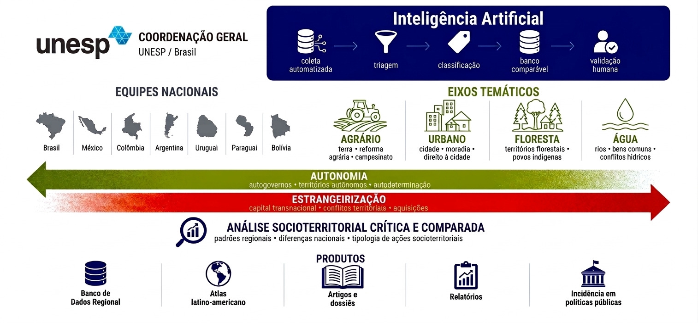

# ObAIAL Pipeline



> **Coordenação geral:** UNESP / Brasil — REDE DATALUTA (CNPq).
> **Equipes nacionais:** Brasil · México · Colômbia · Argentina · Uruguai · Paraguai · Bolívia.
> **Eixos temáticos:** Agrário · Urbano · Floresta · Água.

## Contexto

O **Observatório das Autonomias Indígenas na América Latina (ObAIAL)** monitora,
de forma comparada e continental, dois movimentos socioterritoriais opostos:

- **Autonomia** — autogovernos, territórios autônomos, autodeterminação;
- **Estrangeirização** — capital transnacional, conflitos territoriais, aquisições.

A partir desse monitoramento, o projeto produz **análise socioterritorial crítica
e comparada** (padrões regionais, diferenças nacionais, tipologia de ações) e
entrega seus resultados como Banco de Dados Regional, Atlas latino-americano,
artigos e dossiês, relatórios e incidência em políticas públicas.

O volume de notícias relevantes para sete países é grande demais para triagem e
classificação manuais. Por isso o projeto usa um **pipeline de Inteligência
Artificial** com cinco etapas — exatamente o fluxo do diagrama acima:

| Etapa | O que faz | Quem executa |
|-------|-----------|--------------|
| **1. Coleta automatizada** | Recebe os Google Alerts por e-mail e extrai o texto completo de cada notícia | Sistema |
| **2. Triagem** | Descarta ruído (ação puramente estatal, idioma fora de PT/ES, página inacessível) | Sistema |
| **3. Classificação** | Estrutura cada notícia segundo a metodologia do projeto (ver RAG abaixo) | Sistema (Claude AI) |
| **4. Banco comparável** | Normaliza tudo contra as listas controladas e grava na planilha do projeto | Sistema |
| **5. Validação humana** | Pesquisador(a) revisa e confirma os registros já estruturados | **Humano** |

## O que é o RAG e por que ele existe aqui

**RAG** (*Retrieval-Augmented Generation*, "geração aumentada por recuperação") é
a técnica que faz a IA classificar usando **o conhecimento do próprio projeto**,
e não conhecimento genérico da internet. Em vez de perguntar ao modelo "o que
você acha desta notícia?", o pipeline primeiro **recupera** a metodologia oficial
do ObAIAL e a injeta no pedido enviado ao Claude.

A metodologia é a **Árvore da Autonomia** (Alkmin, 2024): 13 estratégias de
autonomia indígena, cada uma com suas ações-matriz, critérios de inclusão e
exclusão, evidência mínima e exemplos. Tudo isso vive nas abas `LISTAS`,
`MATRIZES` e `CODEBOOK` da Google Sheet — quem mantém a metodologia é a equipe,
não o código.

O RAG funciona em três momentos:

1. **Pré-triagem determinística** (`score_strategies`) — antes de chamar a IA, o
   sistema pontua as 13 estratégias por sobreposição de termos com o texto da
   notícia e seleciona as candidatas mais prováveis. Isso é puramente
   algorítmico, sem IA, e é reprodutível.
2. **Montagem do contexto dinâmico** (`build_rag_context`) — o sistema monta um
   "dossiê" enxuto contendo **apenas** as listas controladas e as matrizes
   relevantes para as estratégias candidatas. Esse dossiê é anexado ao prompt do
   Claude, junto com o texto da notícia e o esquema de saída em JSON.
3. **Normalização pós-IA** (`validate_action`) — a resposta do Claude é validada
   campo a campo contra as listas controladas. Valores fora do vocabulário do
   projeto são corrigidos ou rejeitados, com a ressalva registrada em
   `OBSERVACOES`. O banco nunca recebe categorias "inventadas".

Se as abas de metodologia não estiverem disponíveis na planilha, o pipeline usa
um RAG estático de fallback (`RAG_CONTEXT_FALLBACK`), garantindo que ele nunca
roda sem referência metodológica.

O efeito do RAG é triplo: a classificação fica **fiel à metodologia do projeto**,
**rastreável** (toda decisão se ancora numa lista/matriz citável) e **fácil de
evoluir** — mudar a metodologia é editar a planilha, não reprogramar o sistema.

## O objetivo: preservar a análise humana

Este sistema **não substitui o pesquisador — ele protege o trabalho dele.**

A triagem e a classificação de notícias são tarefas repetitivas e exaustivas.
Feitas manualmente, em escala continental, elas consomem justamente a energia
analítica que deveria estar voltada à interpretação crítica. Pior: o cansaço
introduz inconsistência — a 1ª notícia do dia é avaliada com um rigor, a 100ª
com outro.

A IA não cansa. Ela aplica **a centésima análise com o mesmo critério da
primeira**: o mesmo conjunto de estratégias, os mesmos critérios de inclusão e
exclusão, a mesma exigência de evidência. O resultado é um banco **comparável**
de ponta a ponta — pré-condição para a análise socioterritorial comparada que é
o produto final do projeto.

Com isso, o(a) pesquisador(a) deixa de gastar tempo *garimpando e pré-formatando*
notícias e passa a atuar onde o julgamento humano é insubstituível: a **validação
humana** (etapa 5). Cada registro chega até essa etapa **já pré-selecionado,
já estruturado e já ancorado na metodologia** — cabe ao humano confirmar,
corrigir ou aprofundar, com o olhar crítico preservado para o que importa.

> **Em resumo:** o sistema faz a centésima análise como a primeira, para que a
> análise humana — escassa e valiosa — seja reservada às notícias que já passaram
> por uma triagem rigorosa e consistente.

---

## Sobre este repositório

Pipeline do **Observatório das Autonomias Indígenas na América Latina
(ObAIAL)**: coleta Google Alerts via Gmail → scraping do texto completo →
RAG dinâmico → classificação multi-ação com Claude AI → grava na Google Sheet.

Roda em uma função **AWS Lambda** e processa **o mês anterior em chunks**:
um job é iniciado **1x/mês** (dia 1) e várias **sessões de ~8 min** (a cada
~12 min) cobrem o mês inteiro, retomando de onde pararam via deduplicação. Ao
concluir o mês, envia um **digest de validação por e-mail** (Gmail API) com uma
amostra de positivos e negativos; o **feedback humano** preenchido na planilha
(`VALIDACAO_HUMANA`/`COMENTARIO_HUMANO`) vira **few-shot** na rodada seguinte.

> **Por que chunks?** Um mês tem ~600 e-mails / milhares de itens, que não cabem
> nos 900 s (teto do Lambda). Quebrar em sessões curtas e gravar em lotes
> pequenos (`OBAIAL_FLUSH_EVERY=5`) garante progresso salvo mesmo sob timeout.

---

## Como funciona — o fluxo do pipeline

Em cada sessão (chunk) o pipeline percorre, para cada notícia, uma esteira de
etapas da caixa de entrada do Gmail até a linha gravada na planilha. O desenho
abaixo é o mesmo do cabeçalho de
[`obAIAL_pipeline_merged.py`](src/obAIAL_pipeline_merged.py):

```text
  Gmail (Google Alerts)
       │   get_gmail_service — autentica via OAuth (AWS Secrets Manager)
       ▼
  parse_google_alerts_items()         extrai título + URL de cada digest
       ▼
  deduplicação dupla                  descarta o que já está na planilha
       │   (URL canônica + hash sha256)
       ▼
  fetch_html() + extract_main_text()  baixa a página e isola o texto da notícia
       ▼
  detect_language_pt_es()             descarta idiomas fora de PT/ES
       ▼
  score_strategies() → build_rag_context()    monta o RAG dinâmico
       ▼
  _chamar_claude_com_retry()          classifica com o Claude (multi-ação)
       ▼
  validate_action()                   normaliza a saída contra as listas controladas
       ▼
  GeoCoder.geocode_municipio()        coordenadas aproximadas do município
       ▼
  build_registro()                    monta a linha no schema da planilha
       ▼
  append_records_batch()              grava na aba principal (lotes incrementais)
       ▼
  sheets_append_values(RAW_TEXT)      grava a linha de auditoria
       ▼
  salvar_excel()                      (opcional) cópia local .xlsx formatada
```

### Passo a passo

**Coleta**

1. **Gmail (Google Alerts)** — `get_gmail_service` autentica no Gmail com um
   token OAuth guardado no AWS Secrets Manager e busca os e-mails de digest do
   Google Alerts das últimas 24h.
2. **`parse_google_alerts_items()`** — varre o HTML de cada digest e extrai
   título, URL canônica e fonte de cada notícia, descartando os links de
   interface do próprio e-mail.

**Triagem**

3. **Deduplicação dupla** — antes de gastar qualquer recurso, descarta notícias
   já registradas, conferindo tanto a URL canônica quanto um hash `sha256`.
4. **`fetch_html()` + `extract_main_text()`** — baixa a página da notícia e
   isola o texto principal (prefere a tag `<article>`; se não houver, escolhe o
   bloco de maior densidade textual).
5. **`detect_language_pt_es()`** — heurística de idioma; notícias fora de
   português e espanhol são descartadas automaticamente.

**Classificação — o núcleo de IA**

6. **`score_strategies()` → `build_rag_context()`** — *RAG dinâmico*: uma
   pré-triagem determinística ranqueia as 13 estratégias da Árvore da Autonomia
   por sobreposição de termos e monta um contexto enxuto só com as listas e
   matrizes relevantes (ver *O que é o RAG* acima).
7. **`_chamar_claude_com_retry()`** — envia texto + RAG + esquema ao Claude, que
   classifica a notícia. Uma única notícia pode gerar **várias ações** — cada
   ação autonômica vira uma linha. Há retry com espera exponencial em caso de
   falha de API.
8. **`validate_action()`** — normaliza a resposta do Claude contra as listas
   controladas do projeto; valores fora do vocabulário são corrigidos ou
   anotados em `OBSERVACOES`.
9. **`GeoCoder.geocode_municipio()`** — coordenadas aproximadas do município
   (Nominatim, com cache local e arredondamento a 0,1°).
10. **`build_registro()`** — monta o dicionário final com as colunas do schema
    da planilha.

**Gravação — o banco comparável**

11. **`append_records_batch()`** — grava os registros na aba principal `Obial`,
    em lotes incrementais (resiliente a timeout — ver *Observações operacionais*).
12. **`sheets_append_values(RAW_TEXT)`** — grava uma linha de auditoria na aba
    `RAW_TEXT` (texto extraído, status, hashes) para rastreabilidade e
    reprocessamento. Opcionalmente, `salvar_excel()` gera uma cópia local
    `.xlsx` formatada.

> Ao fim da esteira, cada notícia chega à planilha **já estruturada e
> classificada** — pronta para a **validação humana** (etapa 5 do diagrama no
> topo), em que o(a) pesquisador(a) confirma, corrige ou aprofunda o resultado.

---

## ⚠️ Segurança — leia antes de qualquer commit

Este repositório **NÃO contém segredos**. Toda credencial vem do
**AWS Secrets Manager** em tempo de execução.

O [`.gitignore`](.gitignore) bloqueia `.env`, tokens e chaves. **Confirme** que
nenhum segredo será enviado antes do primeiro push:

```bash
git status --ignored        # os arquivos de segredo devem aparecer como "ignored"
git add -A && git status    # revise: nada de .env / *.json de credencial na lista
```

### Credenciais que devem ser ROTACIONADAS

Os arquivos abaixo existiam em texto puro nesta pasta (que está sincronizada
pelo OneDrive). Trate-os como **comprometidos** e gere novas credenciais:

| Arquivo local            | Credencial                       | Ação |
|--------------------------|----------------------------------|------|
| `.env`                   | Chave da API Anthropic           | Revogar em console.anthropic.com e gerar nova |
| `obial-gcp.json`         | Chave da service account GCP     | Apagar a chave no Google Cloud IAM e gerar nova |
| `client_secret.json`     | OAuth client secret do Google    | Rotacionar no Google Cloud Console se exposto |
| `token.json`             | Token OAuth do Gmail             | Regerar (ver abaixo) |

Depois de rotacionar, guarde as **novas** credenciais apenas no Secrets Manager.

---

## Estrutura

```
.
├── src/
│   ├── obAIAL_pipeline_merged.py   # código final (CLI + lambda_handler)
│   ├── config/field_map.yml        # mapeamento de campos -> colunas da Sheet
│   └── requirements.txt            # dependências (usado por `sam build`)
├── template.yaml                   # infraestrutura AWS SAM (Lambda + schedule + IAM)
├── docs/
│   └── arquitetura-obaial.jpeg     # diagrama exibido no topo deste README
├── .env.example                    # modelo de configuração local
├── .gitignore
└── _legacy/                        # versões antigas (ignoradas pelo git)
```

---

## Segredos no AWS Secrets Manager

Crie três segredos na região `sa-east-1` (ajustável via parâmetro do SAM):

```bash
# 1. Chave da API Anthropic (string pura OU JSON {"ANTHROPIC_API_KEY":"..."})
aws secretsmanager create-secret --region sa-east-1 \
  --name anthropic/obaial/api_key \
  --secret-string 'sk-ant-...'

# 2. Service account do Google Sheets (conteúdo do JSON da SA)
aws secretsmanager create-secret --region sa-east-1 \
  --name gcp/sheets_service_account \
  --secret-string file://nova-service-account.json

# 3. Token OAuth do Gmail (conteúdo do token.json)
aws secretsmanager create-secret --region sa-east-1 \
  --name gmail/obaial/token \
  --secret-string file://token.json
```

> A Lambda tem permissão de `PutSecretValue` **apenas** no segredo do Gmail,
> para regravar o token quando o `refresh_token` é renovado.

### Regerar o `token.json` do Gmail

> ⚠️ **Escopo de envio obrigatório.** O digest é enviado pela **Gmail API**, então
> o token precisa do escopo `gmail.modify` (leitura **e** envio). Um token antigo
> só-leitura (`gmail.readonly`) **não envia e-mail** — regere com o escopo abaixo.

Localmente, com o `client_secret.json` do projeto:

```python
from google_auth_oauthlib.flow import InstalledAppFlow
SCOPES = ["https://www.googleapis.com/auth/gmail.modify"]
flow = InstalledAppFlow.from_client_secrets_file("client_secret.json", SCOPES)
creds = flow.run_local_server(port=0)
open("token.json", "w").write(creds.to_json())
```

Envie o `token.json` resultante para o Secrets Manager (passo 3 acima). O e-mail
do digest sai da conta Google dona desse token.

> Dica: se o app OAuth estiver em modo **"Testing"**, o `refresh_token` expira em
> 7 dias. Publique o app (status **"In production"**) para o token não expirar.

---

## Execução local

```bash
python -m venv .venv && source .venv/bin/activate   # Windows: .venv\Scripts\activate
pip install -r src/requirements.txt

cp .env.example .env        # preencha ANTHROPIC_API_KEY
# As credenciais AWS vêm do seu perfil (`aws configure`); Gmail/Sheets ainda
# são lidos do Secrets Manager.

python src/obAIAL_pipeline_merged.py --dry-run    # teste sem chamar Claude/Sheet
python src/obAIAL_pipeline_merged.py --limit 3    # run legado (24h), 3 itens

# Backfill mensal (inicia o job + roda UM chunk local):
python src/obAIAL_pipeline_merged.py --backfill-month 2026-05 --limit 5 --dry-run
python src/obAIAL_pipeline_merged.py --backfill-month 2026-05 --limit 5

# Testar só o envio do digest de um mês já processado:
python src/obAIAL_pipeline_merged.py --send-digest 2026-05
```

---

## Deploy na AWS (SAM)

Pré-requisitos: [AWS SAM CLI](https://docs.aws.amazon.com/serverless-application-model/latest/developerguide/install-sam-cli.html)
e credenciais AWS configuradas.

```bash
sam build
sam deploy --guided        # primeira vez: salva escolhas em samconfig.toml
```

No `--guided`, confirme/ajuste os parâmetros (região dos segredos, IDs,
`BackfillInitSchedule`, `BackfillChunkSchedule`). Deploys seguintes:

```bash
sam build && sam deploy
```

O `template.yaml` provisiona:

- a função Lambda (`python3.13`, timeout 900 s, 1024 MB);
- **dois** agendamentos EventBridge:
  - `BackfillInit` — `cron(0 6 1 * ? *)`: inicia o job do mês anterior (dia 1);
  - `BackfillChunk` — `rate(12 minutes)`: processa o mês em chunks e, ao concluir,
    envia o digest. Ticks ociosos (sem job ativo) são no-op baratos;
- política IAM de **privilégio mínimo** — acesso somente aos 3 segredos do projeto
  (o envio de e-mail usa o token OAuth do Gmail, **sem** IAM adicional);
- grupo de logs no CloudWatch com retenção de 90 dias.

### Pré-requisitos da operação mensal

1. **Token do Gmail com escopo `gmail.modify`** (ver acima) — necessário p/ enviar.
2. **Aba `DESTINATARIOS`** na planilha (criada automaticamente; preencha as colunas
   `EMAIL`, `NOME`, `ATIVO`). Quem estiver com `ATIVO=Não` não recebe.
3. As abas **`ESTADO`** (cursor do backfill) e **`DESTINATARIOS`** são criadas pelo
   próprio pipeline na primeira execução.

### Testar / rodar manualmente a função publicada

```bash
# Rodar o backfill de um mês específico AGORA (ex.: Maio/26):
aws lambda invoke --function-name obaial-pipeline-diario \
  --payload '{"mode":"backfill_init","mes":"2026-05"}' \
  --cli-binary-format raw-in-base64-out out.json && cat out.json
# Em seguida, deixe o schedule de chunk cobrir o mês — ou force um chunk:
aws lambda invoke --function-name obaial-pipeline-diario \
  --payload '{"mode":"backfill_chunk"}' \
  --cli-binary-format raw-in-base64-out out.json && cat out.json
```

---

## Observações operacionais

- **Cache de geocoding:** no Lambda só `/tmp` é gravável; o código usa
  `/tmp/geocode_cache.json` automaticamente. Não persiste entre invocações.
- **Idempotência / retomada:** o pipeline deduplica por URL canônica e por hash
  `sha256` (lendo `Obial` **e** `RAW_TEXT`). É exatamente esse mecanismo que
  permite a um chunk **retomar um dia parcialmente processado**: ao reprocessar o
  mesmo dia, os itens já gravados são pulados. Não há cursor intra-dia.
- **Estado do backfill:** a aba `ESTADO` guarda `JOB_MES`, `CURSOR_DIA`, `STATUS`
  (`EM_ANDAMENTO`→`CONCLUIDO`→`DIGEST_ENVIADO`) e contadores. Para reprocessar um
  mês do zero, basta invocar `backfill_init` para ele de novo.
- **Digest:** enviado uma vez, quando o mês conclui. Se faltar destinatário em
  `DESTINATARIOS` ou não houver registros do mês, o envio é pulado (log de aviso).
- **Falhas:** exceções são propagadas para o Lambda registrar o erro no
  CloudWatch. Configure um alarme em `Errors` da função para ser notificado.
